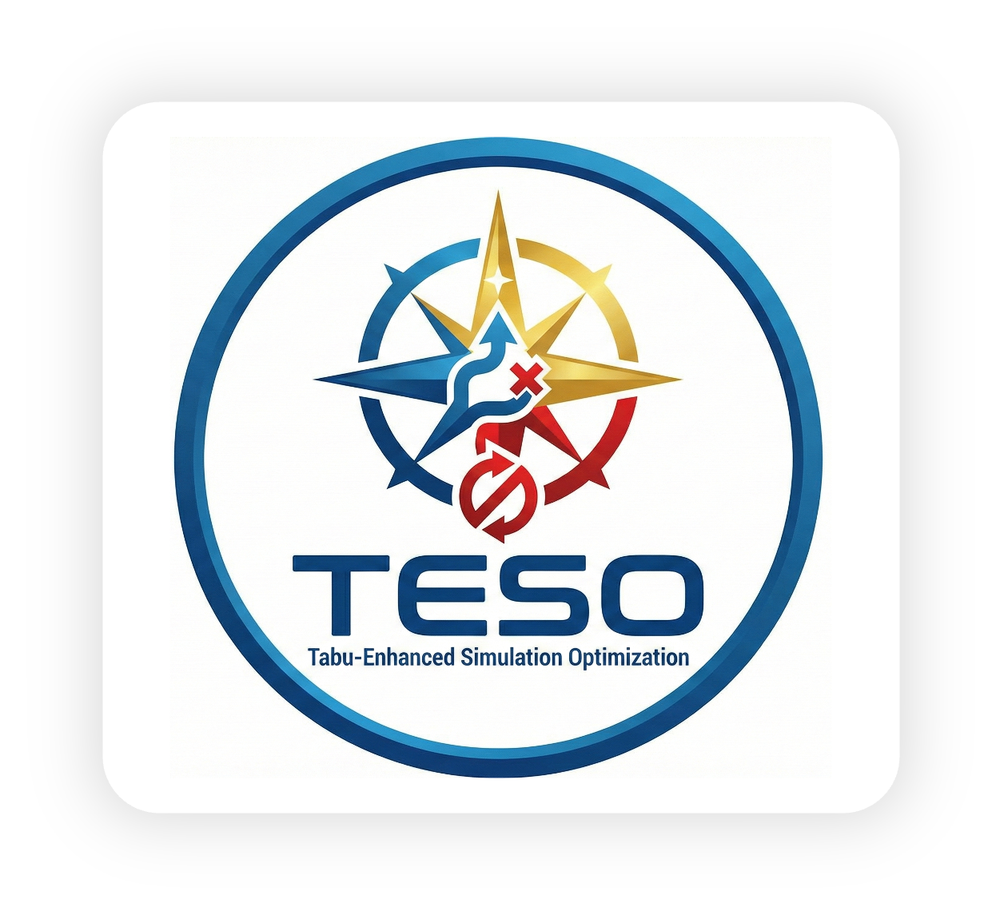

# TESO – Tabu‐Enhanced Simulation Optimization

<p align="center">
  
</p>

<p align="center">
  <em>Presented at the Winter Simulation Conference 2025, Seattle, Washington (December 7–10, 2025)</em>
</p>

---

**TESO** is a Python package that implements a simulation optimization algorithm based on tabu search and complex memory strategies.  
TESO is designed to efficiently solve simulation problems with noisy objectives by combining:

- **Diversification:** Random sampling of design variables to explore a wide solution space.
- **Intensification:** Guided local search around promising (elite) candidates.
- **Tabu List & Aspiration:** A memory-based mechanism to forbid revisiting recently explored solutions while permitting high-quality candidates even if they are tabu.

TESO is especially useful for simulation optimization problems where function evaluations are expensive and stochastic (i.e. simulation outputs contain noise). An example application provided is the classical M/M/1 queue optimization problem.

---

## Table of Contents

- [TESO – Tabu‐Enhanced Simulation Optimization](#teso--tabuenhanced-simulation-optimization)
  - [Table of Contents](#table-of-contents)
  - [Features](#features)
  - [Installation](#installation)
    - [Requirements](#requirements)
    - [Clone and Install](#clone-and-install)
  - [Usage](#usage)
    - [Using TESO as a Package](#using-teso-as-a-package)
    - [Example: Solving an M/M/1 Queue Problem](#example-solving-an-mm1-queue-problem)
  - [Project Structure](#project-structure)
  - [Dependencies](#dependencies)
  - [Contributing](#contributing)
  - [License](#license)
  - [Contact](#contact)

---

## Features

- **Tabu-Enhanced Search:** TESO combines random sampling with memory-based intensification to escape local optima.
- **Elite Memory Storage:** Keeps track of best candidates found, and uses these to guide neighborhood search.
- **Adaptive Perturbations:** Dynamically adjusts the search noise (perturbation magnitude), balancing exploration and exploitation.
- **Flexible Variable Handling:** Supports continuous, discrete, and categorical decision variables with dedicated modules.
- **Open Architecture:** Modular design allowing easy customization or extension.
- **Integration with Simulation Models:** Easily integrates with simulation models (see MM1 queue problem example) so that noisy simulation responses can be directly used in optimization.

---

## Installation

### Requirements

Before installing TESO, make sure you have:

- Python 3.7 or higher.
- [NumPy](https://numpy.org) for numerical computations.
- [mrg32k3a](https://pypi.org/project/mrg32k3a/) for random number generation.
- Optionally, the [simopt](https://github.com/yourusername/simopt) package (or any appropriate simulation optimization dependencies) if you use additional functionality or integrate with simulation models.

### Clone and Install

1. Clone the repository:

   ```bash
   git clone https://github.com/bulentsoykan/TESO.git
   cd TESO
   ```

2. Create a virtual environment (recommended):

   ```bash
   python -m venv .venv
   source .venv/bin/activate   # On Windows use: .venv\Scripts\activate
   ```

3. Install the dependencies. For convenience the required static dependencies are stored in `requirements.txt`:

   ```bash
   pip install -r requirements.txt
   ```

4. Install TESO in editable mode:

   ```bash
   pip install -e .
   ```

This will make the package available locally as a standard Python package.

---

## Usage

### Using TESO as a Package

In your Python scripts you can import key modules and classes directly from TESO. For example:

```python
from teso import SimulationStudyTabu, Trial, OptimizationLogger

# Create an optimizer instance
optimizer = SimulationStudyTabu(
    direction="minimize",
    n_init_points=5,
    initial_noise=0.5,
    final_noise=0.05,
    random_state=42,
    verbose=True,
    n_replications=5,
    max_no_improve=10
)
```

Use the provided `Trial` methods to suggest decision variables and drive simulation replications.

### Example: Solving an M/M/1 Queue Problem

An example problem is provided in the `examples/` folder. In this example, TESO is applied to an M/M/1 queue simulation model (from literature) where the objective is to minimize the average sojourn time plus a quadratic cost term on the service rate (mu). 

The provided [main.py](examples/main.py) demonstrates:
- Importing the TESO optimizer.
- Defining an objective function that:
  - Uses TESO’s `Trial` object to suggest values.
  - Runs one replication of the M/M/1 queue simulation (using an exponential distribution for arrival and service times).
  - Computes a combined objective:  
    `objective = avg_sojourn_time + cost * (mu^2)`
- Running the simulation optimization over a set number of trials.
- Retrieving and printing the best candidate solution.

To run the example, execute:

```bash
python examples/main.py
```

Watch the console for TESO’s log messages and the final best candidate solution and objective value.

---

## Project Structure

The repository is organized as follows:

```
TESO/
├── LICENSE
├── README.md
├── requirements.txt               # Dependency list generated via uv pip freeze > requirements.txt
├── setup.py                       # Packaging instructions
├── teso/
│   ├── __init__.py                # Exports key modules (SimulationStudyTabu, Trial, etc.)
│   ├── memory.py                  # TabuList and EliteMemory classes
│   ├── variable.py                # Variable and CategoryIndexer handling
│   ├── logger.py                  # Logging functionality
│   ├── trial.py                   # Trial class encapsulating a simulation run
│   └── simulation_study_tabu.py   # Main TESO simulation optimization algorithm
└── examples/
    └── main.py                    # Example application solving the M/M/1 queue problem
```

This modular layout facilitates customization and further extension of the TESO framework.

---

## Dependencies

- [Python 3.7+](https://www.python.org/downloads/)
- [numpy](https://numpy.org)
- [mrg32k3a](https://pypi.org/project/mrg32k3a/)
- [simopt](Optional – if you use this package for simulation models)

All required dependencies are also listed in `requirements.txt`.

---

## Contributing

Contributions to TESO are welcome! To contribute:

1. Fork the repository.
2. Create a new branch for your feature or bugfix.
3. Write tests and document your changes.
4. Submit a pull request for review.

Please adhere to the style guidelines and ensure that all tests pass before submitting your contributions.

---

## License

This project is licensed under the [MIT License](LICENSE). See the LICENSE file for details.

---

## Contact

For questions, comments, or suggestions, please reach out to:

- **Bulent Soykan**
- **web:** [bulentsoykan.com](https://bulentsoykan.com) 


---

Happy Optimizing with TESO!